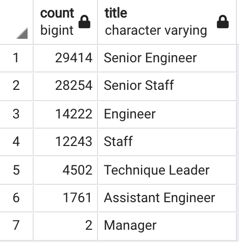
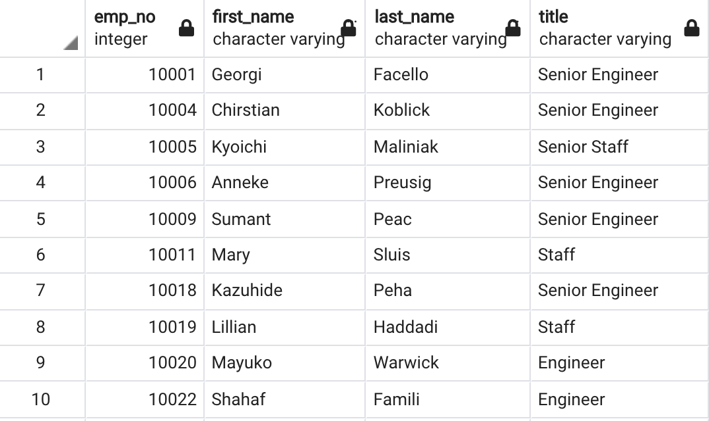
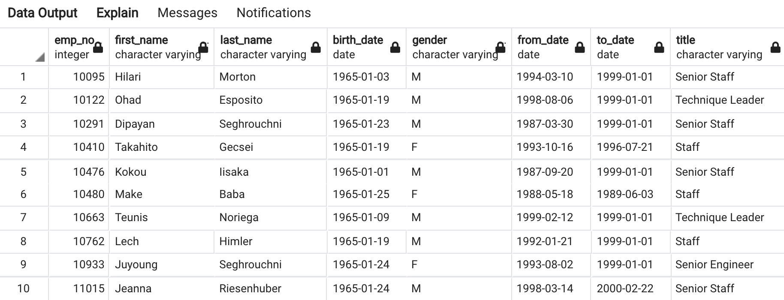
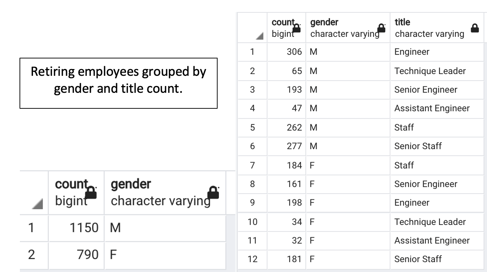

# Pewlett_Hackard_Analysis

## Analysis using SQL

## Overview of the analysis:

The main purpose of this analysis is to organize the Pewlett Hackard (PH) database using PostgreSQL and pgAdmin and get an insight from the company database on the total number of employees from all the departments who are retiring soon. Based on this information the company will make decision calls on the hiring and mentorship process.Postgres is used to create a database, and pgAdmin is used to work with the data that was imported from the PH database. After some initial work with making schemas and SQL queries few data tables were created and exported as csv files under the Data folder in the Pewlett Hackard Analysis folder.

### Explain the purpose of this analysis.

After some initial work with the PH data, some additional work was still needed to be done to get a better insight into the number of people retiring that would help the senior managers decide the future of the company. The new queries that were done determines the number of retiring employees per title, and identifies employees who are eligible to participate in a mentorship program. Again, using SQL queries few tables were created namely unique titles table and retiring titles table which highlights the number of retiring employees based on their designation titles. Some additional work was also done using SQL queries to get an output of the employees born between January 1965 and December 1965, who were eligible for the mentorship program.

## Results:

### Provide a bulleted list with four major points from the two analysis deliverables. Use images as support where needed.

**Deliverable 1 Analysis:**

* From the retiring titles CSV table, it is evident that a total of 90,398 employees born between 1952 and 1955 are about to retire. Large number from these employees are Senior Engineers (29414) and Senior Staff members (28254) of the company.The other employees retiring are Engineers (14222), Staffs (12243), Technique Leaders (4502), Assistant Engineers (1761) and Managers (2).  

* **Highest number of retiring employees are Senior Engineers.**

* The Unique Titles CSV table gives detailed informations about the employees retiring. It includes their unique employment number, first name and last name along with the title he is currently working as. This table has unique names and no name is repeated twice. This is achieved by using the SELECT UNIQUE ON command on the employment number.

**Deliverable 2 Analysis:**

* The mentorship eligibility CSV table is a comprehensive table showing all the employees born in 1965 holding different titles who are eligible for the mentorship program. This table highlights their first name , last name, birthdate and their service years at HP.

* A little further SQL query into the mentorship eligibility table shows the count of employees under each title category who are eligible to mentor. This graph shows 507 engineers , 489 Senior Staffs , 415 Staffs, 353 Senior engineers , 99 Technique Leaders and 77 Assistant Engineers are eligible to mentor. There are 1940 employees in total who are eligible to mentor.  

* Compared to the total number of employees retiring (90,398), the number of employees eligible to mentor (1940) is fairly less.

## Summary: 

Provide high-level responses to the following questions, then provide two additional queries or tables that may provide more insight into the upcoming "silver tsunami."

PH is faced with the challenge of hiring many new employees as huge numbers of their current employees are retiring soon. The hiring managers have an uphill task ahead and they requested some insights about the retiring employees, their titles and departments. The Data Scientist team worked hard to provide some insights about the retiring employees and some interesting informations about the company structure.

* How many roles will need to be filled as the "silver tsunami" begins to make an impact?

From the informations that the Data Scientists provided, it became evident that a total of 90,398 employees born between 1952 and 1955 are about to retire. Most of these employees are Senior Engineers. The company needs to hire 29414 Senior Engineers, 28254 Senior Staff members,14222 Engineers, 12243 Staff members, 4502 Technique Leaders, 1761 Assistant Engineers and 2 Managers.  

* Are there enough qualified, retirement-ready employees in the departments to mentor the next generation of Pewlett Hackard employees?

Some interesting facts that came up from the mentorship eligibility query is that from among all the employees who are retiring a total of 1940 employees are eligible to mentor. A deeper probe into this list shows that among those eligible, 507 are Engineers, 489 are Senior Staffs, 415 are Staffs, 353 are Senior Engineers, 99 are Technique Leaders and 77 are Assistant Engineers.

## Additional queries:
 
Apart from the above tables that were created, I looked into the gender equality in this company. 

Apart from the required queries the Data Scientist team also grouped the retiring employees based on their gender.
* Count the employees who are retiring based on their gender, so that the gender equality can be maintained in the company.

First a new table was created with the names of the retiring employees along with their gender and the title held. This was followed by counting the retiring employees based on their gender. It was found that a total of 1150 males and 790 females are retiring. More males are retiring than the number of females retiring.This could be that the company has more males than females.
In such a scenario, the gender bias can be rectified by employing more female candidates for various posts.

* To take the queries a little further, the Data Scientist team looked into the various titles held by the retiring employees and grouped them by gender. This gives the hiring managers an insight to the total count of titles held by males and females. From this table it is evident that PH had more male engineers (306) compared to female engineers (198). 
From the additional studies it is evident that gender inequality needs to be addressed in t his company.

By looking through the tables created and analyzed by the Data Scientist team, the hiring managers and the authorities have a clear insight into the company structure and can make their strategic decisions and help in proper functioning of Pewlett Hackard.

